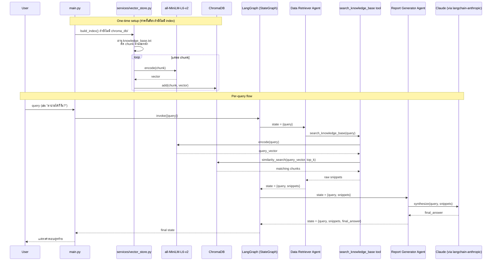

# Agentic AI RAG System — Design Plan (Final)

โปรเจกต์นี้เป็นแบบทดสอบตำแหน่ง AI Engineer (Bangkok Bank) หัวข้อ Agentic AI: สร้างระบบ multi-agent 2 ตัวที่ทำงานต่อกันแบบ sequential โดย agent แรกทำ RAG (retrieval) และ agent ที่สองสังเคราะห์คำตอบ

## สรุปการตัดสินใจ

| หัวข้อ | ตัดสินใจ |
|---|---|
| Orchestration framework | **LangGraph** (`langgraph`) — StateGraph 2 node |
| LLM | Claude ผ่าน `langchain-anthropic` |
| Model | `claude-haiku-4-5` |
| Chunking | **ตัดตามย่อหน้า** (แบ่งด้วยบรรทัดว่าง `\n\n`) — ปลอดภัย ไม่ตัดกลางคำ |
| Embedding | `all-MiniLM-L6-v2` ผ่าน `sentence-transformers` |
| Vector store | **ChromaDB** |
| Knowledge base | Company policy (ภาษาไทย) — ต่อยอดจาก `Ai-Rag-Chat/data/sample.txt` |

## เหตุผลเบื้องหลังการตัดสินใจสำคัญ

**ทำไม LangGraph** — แม้ flow จะเป็นเส้นตรง (ไม่มี branch/loop) ซึ่งในทางวิศวกรรมล้วนๆ ใช้ LangChain LCEL ธรรมดาก็พอ แต่เลือก LangGraph เพราะโจทย์เน้นประเมิน "multi-agent orchestration" และพูดถึง "handoff pattern" ตรงๆ — `StateGraph` ทำให้ orchestration ปรากฏชัดในโครงสร้างโค้ด ต้นทุนที่เพิ่มขึ้นแทบไม่มี (graph 2 node)

**ทำไม ChromaDB + sentence-transformers (ไม่ใช่ TF-IDF)** — ผู้ทำโปรเจกต์ถนัดแนวทาง chunk → embed → vector DB มาก่อน (เคยทำโปรเจกต์ `Ai-Rag-Chat` ที่ใช้ pattern เดียวกัน) จึงเลือกใช้แนวทางที่คุ้นเคยแทน TF-IDF ซึ่งจะทำให้เข้าใจและอธิบายโค้ดตัวเองได้มั่นใจกว่า — ตรวจสอบแล้วว่าไม่ขัดกับข้อกำหนดของโจทย์ (โจทย์ขอแค่ "custom Python function/tool" ที่ทำ "keyword or basic semantic search" ไม่ได้ห้ามใช้ vector DB หรือ embedding model)

**ทำไม chunk ตามย่อหน้า (ไม่ใช่ fixed character count)** — ภาษาไทยไม่มีช่องว่างคั่นคำ การตัดแบบนับตัวอักษรดิบๆ (เช่น `CHUNK_SIZE = 800` แบบที่ `Ai-Rag-Chat` ทำ) เสี่ยงตัดกลางคำ (เช่นได้ chunk ที่ขึ้นต้นว่า "ษัทลาได้...") ทำให้ embedding เพี้ยน การตัดตามย่อหน้า (แบ่งด้วยบรรทัดว่าง) ปลอดภัย 100% เพราะจุดตัดคือขอบเขตที่มีความหมายอยู่แล้ว

## สถาปัตยกรรม

```
knowledge_base.txt
        │
        ▼
[ตัด chunk ตามย่อหน้า] ─── ทำครั้งเดียวตอน build index (ไม่มี ML)
        │
        ▼
[embed แต่ละ chunk ด้วย all-MiniLM-L6-v2] ─── sentence-transformers
        │
        ▼
   ChromaDB (vector store)
        │
        │   ┌───────────────────────────────┐
        │   │           User Query            │
        │   └───────────────────────────────┘
        │                  │
        │                  ▼
        │   ┌───────────────────────────────┐
        └──▶│  Node 1: Data Retriever agent  │
            │  - tool: search_knowledge_base │
            │    (embed query → query Chroma)│
            │  - คืน raw snippets เท่านั้น     │
            └───────────────────────────────┘
                          │  (snippets ผ่าน LangGraph state)
                          ▼
            ┌───────────────────────────────┐
            │ Node 2: Report Generator agent │
            │  - ไม่มี tool                    │
            │  - สังเคราะห์ snippets → คำตอบ    │
            │    เดียว ไม่ซ้ำซ้อน จัดรูปแบบ      │
            └───────────────────────────────┘
                          │
                          ▼
                   Final Answer
```

## Sequence Diagram



### State Schema (LangGraph)

- `query: str` — คำถามจาก user
- `snippets: list[str]` — raw text chunks ที่ retriever คืนมา
- `final_answer: str` — คำตอบสุดท้ายจาก Report Generator

### Node 1: Data Retriever

- **Role/Instructions:** ผู้เชี่ยวชาญด้าน information retrieval ค้นหา snippet ที่เกี่ยวข้องกับคำถามจาก knowledge base เท่านั้น ห้ามตอบคำถามเอง
- **Tool (ตัวเดียว):** `search_knowledge_base(query: str) -> list[str]`
  1. แปลง query เป็นเวกเตอร์ด้วย `all-MiniLM-L6-v2`
  2. ค้นหาใน ChromaDB ว่า chunk ไหนใกล้เคียงที่สุด (cosine similarity, top-k)
  3. คืน raw text ของ chunk เหล่านั้น (ไม่สรุป)
- **Output:** raw snippets ส่งต่อเข้า LangGraph state

### Node 2: Report Generator

- **Role/Instructions:** นักเขียน/นักสังเคราะห์ข้อมูล ใช้ snippets สร้างคำตอบครบถ้วน อ่านง่าย ไม่ซ้ำซ้อน
- **Tool:** ไม่มี
- **Output:** คำตอบสุดท้ายแสดงให้ user เห็น

## Knowledge Base (`knowledge_base.txt`)

หัวข้อ: **Company Policy** (ภาษาไทย) แต่ละหัวข้อคั่นด้วยบรรทัดว่างชัดเจน (เพื่อให้ chunk ตามย่อหน้าทำงานถูกต้อง):

1. นโยบายการลา (ลาป่วย, ลากิจ, วันหยุดประจำปี) — ต่อยอดจาก `Ai-Rag-Chat/data/sample.txt`
2. เวลาทำงาน และค่าล่วงเวลา — ต่อยอดจาก `Ai-Rag-Chat/data/sample.txt`
3. นโยบายการเดินทางไปต่างประเทศ (International Travel Policy) — เขียนใหม่
4. นโยบายการเบิกค่าใช้จ่าย (Expense Reimbursement Policy) — เขียนใหม่

## Dependencies (`requirements.txt`)

```
langgraph
langchain-anthropic
chromadb
sentence-transformers
python-dotenv
```

## โครงสร้างไฟล์

```
Ai-assessment-BangkokBank/
├── PLAN.md                     ← เอกสารนี้
├── CLAUDE.md                   ← context สำหรับ Claude Code
├── knowledge_base.txt          ← ฐานความรู้ company policy (อยู่ root ตามที่โจทย์ระบุชื่อไฟล์ตรงๆ)
├── config.py                   ← รวมค่าคงที่: ANTHROPIC_API_KEY, CLAUDE_MODEL,
│                                  EMBEDDING_MODEL, CHROMA_DIR, KNOWLEDGE_BASE_PATH, TOP_K
├── models/
│   ├── __init__.py
│   └── schemas.py              ← GraphState (TypedDict) — state ที่ไหลผ่าน LangGraph
├── services/
│   ├── __init__.py
│   ├── vector_store.py         ← build/load ChromaDB จาก knowledge_base.txt (chunk ตามย่อหน้า + embed)
│   ├── retriever_tool.py       ← custom tool ค้นหาใน ChromaDB (ผูกกับ Data Retriever agent)
│   └── agents.py               ← นิยาม 2 agents + LangGraph StateGraph
├── main.py                     ← entry point, รัน query ตัวอย่าง (auto-build index ถ้ายังไม่มี)
├── requirements.txt
├── .env.example                ← ANTHROPIC_API_KEY placeholder
├── README.md                   ← วิธีติดตั้ง/รัน + คำอธิบายโปรเจกต์
├── chroma_db/                  ← persisted vector DB (สร้างอัตโนมัติตอนรันครั้งแรก)
└── screenshots/                ← เก็บภาพผลลัพธ์การรันจริง (ใส่ทีหลัง)
```

**เหตุผลของโครงสร้างนี้** (ต่างจาก `routers/services/models` เต็มรูปแบบของ `Ai-Rag-Chat`):
- ไม่มี `routers/` — ไม่มี HTTP API/endpoint ให้แยก โปรเจกต์นี้เป็นสคริปต์รันตรงๆ ไม่ใช่ web service
- มี `services/` — รวม logic เบื้องหลังทั้งหมด (vector store, tool, agent/graph) แยกจาก entry point
- มี `models/schemas.py` — ตาม convention เดียวกับ `Ai-Rag-Chat` (โฟลเดอร์ `models` มีไฟล์ `schemas.py` ข้างใน ไม่ใช่คนละโฟลเดอร์) เก็บ state schema ของ LangGraph เพียงตัวเดียว
- **ไม่มี database models แบบ ORM** (เช่น `class User(Base): __tablename__ = "users"`) เพราะไม่มี relational database ในโปรเจกต์นี้ — มีแค่ ChromaDB (vector database) ซึ่งเข้าถึงผ่าน client library ตรงๆ ไม่ผ่าน ORM
- `knowledge_base.txt` อยู่ root ไม่ใช่ใน `data/` เพราะโจทย์ระบุชื่อไฟล์นี้ตรงๆ ว่าต้องส่ง ให้อยู่ตำแหน่งที่หาเจอง่ายที่สุด

## Query ตัวอย่างที่จะใช้ทดสอบ

1. "พนักงานลาป่วยได้กี่วันต่อปี?"
2. "นโยบายการเดินทางไปต่างประเทศเป็นยังไง?"
3. "ทำงานล่วงเวลาได้ค่าตอบแทนไหม?"

## Stretch Goal (ทำถ้ามีเวลาเหลือ หลังจาก core deliverable เสร็จสมบูรณ์เท่านั้น)

**สิ่งที่ต้องส่งจริงตามโจทย์คือโค้ด + `knowledge_base.txt` + screenshot บน GitHub repo เท่านั้น** — ส่วนนี้เป็นของแถมเสริม ไม่ใช่ core requirement และต้องไม่แย่งเวลา/โฟกัสจากส่วนหลัก

แนวคิด: deploy เป็น web app (frontend + API) แล้วส่ง link ให้ลองใช้จริง เก็บ log การใช้งาน เพื่อให้เห็นว่ามีคนทดลองใช้จริง แทนที่จะดูแค่ screenshot

**การกระจาย link:** ส่งผ่าน Gmail ถึงผู้ประเมินโดยตรง + วาง link ไว้ใน private GitHub repo (README) — เป็นการจำกัดการเข้าถึงแบบ "security through obscurity" ไม่ใช่ access control จริงจัง (private repo คุมแค่ใครเห็นโค้ด/link ได้ ไม่ได้ผูกกับตัว deployed server — ถ้า URL หลุดออกไปจากอีเมล ใครมี URL ก็เรียก API ได้โดยตรง) แต่ถือว่าเพียงพอสำหรับ demo ชั่วคราวที่ส่งให้คนกลุ่มเล็ก

**Safety net ที่ควรมีถ้าทำจริง:**
- `max_tokens` จำกัดต่อ request (ป้องกันคำตอบยาวเกินจำเป็น/ค่าใช้จ่ายพุ่ง)
- จำกัดจำนวน request รวมต่อวัน/ช่วงเวลา (กันกรณี link หลุดไปนอกกลุ่มที่ตั้งใจ)
- เก็บ log การใช้งาน (query, timestamp) เพื่อดูว่ามีคนทดลองจริง

**ยังไม่ตัดสินใจ:** hosting platform, frontend (Streamlit/Gradio แบบเร็ว vs React เต็มรูปแบบ), รูปแบบ logging — จะคุยรายละเอียดอีกทีหลัง core deliverable เสร็จ

## ขั้นตอนถัดไป (หลังจาก confirm แผนนี้)

1. ~~เขียน `knowledge_base.txt`~~ ✅ เสร็จแล้ว (15 chunk)
2. เขียน `config.py`
3. เขียน `models/schemas.py` (`GraphState`)
4. เขียน `services/vector_store.py` (chunk ตามย่อหน้า + build/query ChromaDB)
5. เขียน `services/retriever_tool.py` (custom tool)
6. เขียน `services/agents.py` (นิยาม agent + LangGraph graph)
7. เขียน `main.py` (รัน query ตัวอย่าง)
8. เขียน `requirements.txt`, `.env.example`, `README.md`
9. รันทดสอบจริง + capture screenshot
